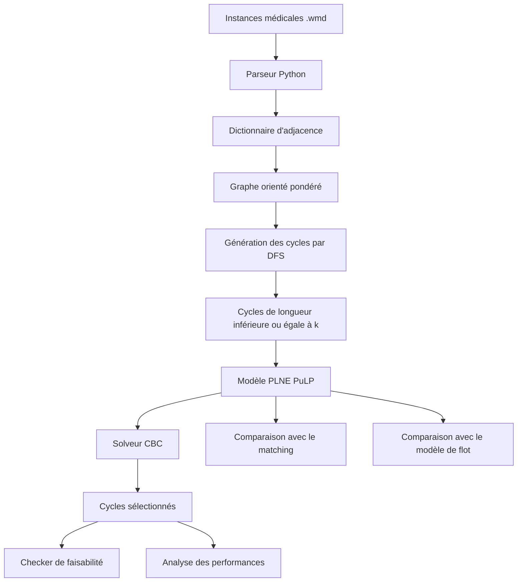

# Optimisation des échanges de reins avec Python

<p align="center">
  
</p>


Projet universitaire de fin de licence consacré à la modélisation et à la résolution du **problème d’échange de reins**, ou **Kidney Exchange Problem**.

L’objectif est de transformer un problème médical réel en un problème d’optimisation combinatoire capable de sélectionner des échanges compatibles entre plusieurs couples donneur-patient.

Le projet mobilise :

- la programmation Python ;
- la théorie des graphes ;
- les parcours en profondeur ;
- la programmation linéaire en nombres entiers ;
- l’optimisation combinatoire ;
- la validation algorithmique ;
- l’analyse du passage à l’échelle.

> Projet réalisé en équipe à l’Université de Bordeaux durant l’année universitaire 2022-2023.

---

## Sommaire

- [Contexte](#contexte)
- [Problématique](#problématique)
- [Objectifs](#objectifs)
- [Principe d’un échange de reins](#principe-dun-échange-de-reins)
- [Données](#données)
- [Modélisation mathématique](#modélisation-mathématique)
- [Architecture de la solution](#architecture-de-la-solution)
- [Algorithmes développés](#algorithmes-développés)
- [Résolution avec PuLP](#résolution-avec-pulp)
- [Validation des solutions](#validation-des-solutions)
- [Résultats](#résultats)
- [Analyse de la complexité](#analyse-de-la-complexité)
- [Technologies utilisées](#technologies-utilisées)
- [Compétences démontrées](#compétences-démontrées)
- [Limites](#limites)
- [Pistes d’amélioration](#pistes-damélioration)
- [Équipe](#équipe)

---

# Contexte

Lorsqu’une personne souhaite donner un rein à un proche, il arrive que le donneur et le patient soient médicalement incompatibles.

Un programme d’échange de reins permet alors de croiser plusieurs couples incompatibles.

Par exemple :

- le donneur du couple A peut être compatible avec le patient du couple B ;
- le donneur du couple B peut être compatible avec le patient du couple A.

Les deux greffes peuvent ainsi être réalisées simultanément.

Avec davantage de couples, il est possible de créer des cycles d’échanges plus longs.

Le problème consiste à déterminer quels échanges doivent être sélectionnés afin de maximiser le nombre ou le bénéfice total des greffes réalisables.

---

# Problématique

Le problème est représenté par un graphe orienté pondéré :

```text
G = (V, A)
```

avec :

- `V` : ensemble des couples donneur-patient incompatibles ;
- `A` : ensemble des compatibilités possibles ;
- `w(i,j)` : bénéfice médical associé à la greffe du donneur `i` vers le patient `j`.

Un sommet représente un couple composé :

- d’un patient ayant besoin d’un rein ;
- d’un donneur vivant souhaitant l’aider ;
- d’une incompatibilité médicale entre ces deux personnes.

Un arc orienté de `i` vers `j` signifie que le donneur du couple `i` peut donner un rein au patient du couple `j`.

Une solution correspond à un ensemble de cycles :

- compatibles ;
- disjoints ;
- de taille inférieure ou égale à une valeur maximale `k`.

Chaque couple ne peut participer qu’à un seul échange.

Les interventions appartenant à un même cycle doivent être organisées simultanément, ce qui justifie la limitation de la longueur des cycles.

Le projet se concentre sur des instances **sans donneur altruiste**. Les solutions sont donc constituées de cycles et non de chaînes initiées par un donneur altruiste.

---

# Objectifs

Les objectifs du projet sont les suivants :

1. formaliser le Kidney Exchange Problem sous forme de programme linéaire en nombres entiers ;
2. importer et structurer des instances médicales simulées ;
3. représenter les compatibilités par des graphes orientés pondérés ;
4. générer automatiquement les cycles admissibles ;
5. limiter les cycles à une taille maximale `k` ;
6. maximiser le bénéfice total des greffes ;
7. garantir que chaque couple apparaît au plus une fois ;
8. résoudre le modèle avec PuLP et le solveur CBC ;
9. vérifier automatiquement la faisabilité des solutions ;
10. encadrer la solution grâce à un matching et à un modèle de flot ;
11. mesurer le nombre de cycles et les temps de résolution ;
12. analyser les limites du modèle sur les grandes instances.

---

# Principe d’un échange de reins

Prenons trois couples donneur-patient incompatibles :

```text
Couple A : donneur A / patient A
Couple B : donneur B / patient B
Couple C : donneur C / patient C
```

Supposons que :

```text
Donneur A → Patient B
Donneur B → Patient C
Donneur C → Patient A
```

Ces compatibilités forment le cycle :

```text
A → B → C → A
```

Trois greffes peuvent alors être organisées simultanément.

Dans un problème comprenant de nombreux couples, plusieurs cycles peuvent exister. Le modèle doit sélectionner la meilleure combinaison de cycles disjoints.

---

# Données

## Format des instances

Les données sont fournies sous forme de fichiers :

```text
.wmd
```

Les instances proviennent du jeu de données PrefLib consacré au Kidney Exchange Problem :

```text
https://www.preflib.org/dataset/00036
```

Les tailles étudiées vont notamment de :

```text
16 à 2 048 couples donneur-patient
```

Le projet utilise uniquement les instances sans donneur altruiste.

## Contenu d’une instance

Chaque fichier contient notamment :

- le nombre de couples ;
- le nombre d’arcs ;
- le sommet source ;
- le sommet destination ;
- le poids de chaque compatibilité.

| Élément | Signification | Utilisation |
|---|---|---|
| Sommets | Couples donneur-patient incompatibles | Unités du graphe |
| Arcs orientés | Compatibilité entre un donneur et un patient | Greffes potentielles |
| Poids | Bénéfice associé à une greffe | Fonction objectif |
| Fichiers `.wmd` | Instances médicales simulées | Tests algorithmiques |

Dans les instances étudiées, les arcs disposent généralement d’un poids égal à 1.

Le code a toutefois été conçu pour accepter des poids différents.

---

# Préparation des données

Un parseur Python lit chaque instance et récupère :

- le nombre de couples ;
- le nombre d’arcs ;
- les donneurs ;
- les patients compatibles ;
- les poids des greffes.

Une classe `Arete` représente chaque compatibilité :

```python
class Arete:
    def __init__(self, s):
        self.donneur = int(s[0])
        self.patient = int(s[1])
        self.poid = float(s[2])
```

Les données sont ensuite regroupées dans un dictionnaire d’adjacence :

```python
dico_graphe = {
    1: [3, 16],
    2: [4, 14],
    3: [5]
}
```

Dans cet exemple, le donneur du couple `1` est compatible avec les patients des couples `3` et `16`.

Cette structure est utilisée par :

- l’algorithme de génération de cycles ;
- le modèle PLNE ;
- le modèle de flot ;
- le problème de matching ;
- la visualisation du graphe.

---

# Modélisation mathématique

## Ensemble des cycles

On note :

```text
Uₖ = ensemble des cycles de longueur inférieure ou égale à k
```

Pour chaque cycle `u`, une variable binaire est créée :

```text
xᵤ = 1 si le cycle u est sélectionné
xᵤ = 0 sinon
```

Le poids du cycle correspond à la somme des poids de ses arcs :

```text
wᵤ = somme des bénéfices des greffes du cycle u
```

## Fonction objectif

Le modèle maximise le poids total des cycles sélectionnés :

```math
\max \sum_{u \in U_k} w_u x_u
```

## Contraintes de disjonction

Pour chaque couple `i` :

```math
\sum_{u : i \in u} x_u \leq 1
```

Cette contrainte garantit qu’un couple donneur-patient ne participe pas à plusieurs cycles.

## Variables

```math
x_u \in \{0,1\}
```

Le modèle est donc un programme linéaire en nombres entiers.

---

# Architecture de la solution



---

# Algorithmes développés

## Classe `Cycle`

La classe `Cycle` stocke :

- les sommets appartenant au cycle ;
- la taille du cycle ;
- le poids total du cycle.

```python
class Cycle:
    def __init__(self, liste):
        self.cycle = liste
        self.taille = len(liste)
        self.poids = calculer_poids(liste)
```

---

## Génération des cycles

Les cycles sont générés grâce à un parcours en profondeur, ou DFS.

Fonctions principales :

```python
parcours_en_profondeur(...)
trouver_cycles(...)
```

Le principe est le suivant :

1. choisir un sommet de départ ;
2. ajouter le sommet à une pile ;
3. visiter récursivement ses voisins ;
4. détecter un cycle lorsque le parcours revient au sommet de départ ;
5. arrêter le parcours lorsque la longueur maximale `k` est atteinte ;
6. enregistrer la taille et le poids du cycle ;
7. recommencer depuis les autres sommets.

Cette génération exhaustive permet d’obtenir tous les cycles admissibles, mais son coût augmente très rapidement avec la taille du graphe et avec `k`.

---

## Visualisation du graphe

Le notebook utilise NetworkX pour représenter les compatibilités :

```python
graphe = nx.DiGraph(dico_graphe)
```

Les sommets représentent les couples donneur-patient et les flèches représentent les greffes potentielles.

La visualisation permet notamment de :

- vérifier la structure du graphe ;
- repérer les sommets isolés ;
- observer les compatibilités ;
- illustrer les cycles potentiels.

---

# Résolution avec PuLP

Le modèle principal est créé avec PuLP :

```python
prob = LpProblem(
    "Kidney_Exchange_Problem",
    LpMaximize
)
```

Une variable binaire est associée à chaque cycle :

```python
x = LpVariable.dicts(
    name="x",
    indices=range(len(cycles)),
    cat="Binary"
)
```

La fonction objectif maximise le poids total :

```python
prob += lpSum(
    x[u] * cycles[u].poids
    for u in range(len(cycles))
)
```

Une contrainte est ajoutée pour chaque couple :

```python
for i in range(nombre_couples):
    cycles_contenant_i = []

    for u in range(len(cycles)):
        if i + 1 in cycles[u].get_sommets():
            cycles_contenant_i.append(u)

    prob += lpSum(
        x[u] for u in cycles_contenant_i
    ) <= 1
```

Le modèle est résolu avec CBC :

```python
prob.solve(
    PULP_CBC_CMD(
        timeLimit=300,
        threads=4
    )
)
```

Le programme affiche ensuite :

- le statut du modèle ;
- le temps de résolution ;
- la valeur de la fonction objectif ;
- les cycles sélectionnés ;
- le poids de chaque cycle.

---

# Validation des solutions

Trois méthodes complémentaires sont utilisées.

## 1. Checker

Un checker vérifie deux conditions :

- tous les cycles ont une taille inférieure ou égale à `k` ;
- tous les cycles sélectionnés sont disjoints.

```python
def checker(cycles, k):

    for cycle in cycles:
        if len(cycle) > k:
            return False

    for i in range(len(cycles)):
        for j in range(i + 1, len(cycles)):
            if set(cycles[i]) & set(cycles[j]):
                return False

    return True
```

Le checker permet de confirmer que la solution est réalisable d’un point de vue opérationnel.

---

## 2. Matching pour `k = 2`

Lorsque la taille maximale des cycles est fixée à deux, le problème devient un problème de matching.

Le matching permet d’obtenir une borne inférieure pour le problème général :

```text
Valeur du matching ≤ Valeur du PLNE
```

Les arcs réciproques du graphe orienté sont transformés en arêtes d’un graphe non orienté.

Une variable binaire indique ensuite si chaque échange réciproque est sélectionné.

---

## 3. Modèle de flot pour `k` non limité

Un modèle de flot est utilisé sans contrainte sur la longueur maximale des cycles.

Il impose notamment :

- au plus une greffe entrante par sommet ;
- au plus une greffe sortante par sommet ;
- l’égalité entre le flot entrant et le flot sortant.

Ce modèle fournit une borne supérieure :

```text
Valeur du PLNE ≤ Valeur du flot
```

La solution principale doit donc vérifier :

```text
Matching ≤ PLNE ≤ Flot
```

Cet encadrement renforce la confiance dans les résultats obtenus.

---

# Exemple de solution

Sur l’une des petites instances étudiées, le modèle obtient une solution optimale de poids total égal à 4.

Les cycles sélectionnés sont :

```text
[4, 6]
[14, 15]
```

Chaque cycle a un poids égal à 2.

Les cycles sont :

- disjoints ;
- de longueur 2 ;
- compatibles avec la valeur maximale de `k` ;
- validés par le checker.

Cet exemple illustre le fonctionnement du modèle. Les solutions dépendent naturellement de l’instance et de la valeur de `k`.

---

# Résultats

Les principaux résultats du projet sont les suivants :

- les solutions produites respectent les contraintes de taille ;
- les cycles sélectionnés sont disjoints ;
- chaque couple participe à au plus un échange ;
- les valeurs du PLNE sont encadrées par le matching et le flot ;
- la génération de cycles fonctionne sur des instances de tailles variées ;
- le nombre de cycles augmente fortement avec le nombre de couples ;
- le temps de résolution augmente rapidement avec la taille des instances ;
- le temps de calcul augmente également avec la valeur de `k` ;
- la génération exhaustive des cycles constitue le principal goulot d’étranglement.

---

# Analyse de la complexité

## Influence du nombre de couples

Lorsque le nombre de couples augmente :

- le graphe contient davantage de sommets ;
- le nombre de compatibilités augmente ;
- le nombre de cycles potentiels devient très élevé ;
- la mémoire nécessaire augmente ;
- le temps de génération des cycles augmente ;
- le temps de résolution du PLNE augmente.

Les résultats montrent une forte augmentation du nombre de cycles à partir des grandes instances.

Le temps de résolution du PLNE augmente notamment de manière importante à partir des instances comprenant plusieurs centaines de couples.

---

## Influence de la taille maximale `k`

Lorsque `k` augmente :

- davantage de chemins doivent être explorés ;
- de nouveaux cycles deviennent admissibles ;
- le nombre de variables du PLNE augmente ;
- le temps de génération augmente ;
- le temps de résolution augmente.

Les expériences montrent toutefois que la valeur de la fonction objectif augmente surtout pour les petites valeurs de `k`.

À partir de :

```text
k = 3
```

le gain supplémentaire sur le nombre maximal de greffes devient généralement faible, tandis que le coût de calcul continue à progresser fortement.

---

## Compromis principal

Le projet met en évidence un compromis classique :

```text
Qualité et exactitude de la solution
                contre
Temps de calcul et passage à l’échelle
```

La génération exhaustive des cycles permet d’obtenir une formulation exacte et une solution de référence.

Elle devient cependant difficile à utiliser lorsque :

- le nombre de couples augmente ;
- le graphe devient dense ;
- la taille maximale des cycles augmente.

---

# Fichiers générés

Le notebook peut produire plusieurs fichiers :

```text
résultat.txt
solution.txt
solutionmatching.txt
```

Ils contiennent notamment :

- le nom de l’instance ;
- la valeur de `k` ;
- le nombre de cycles ;
- le statut du modèle ;
- le temps de résolution ;
- la valeur de la fonction objectif ;
- les cycles sélectionnés.

---

# Technologies utilisées

## Python

Utilisé pour :

- lire les données ;
- représenter les graphes ;
- générer les cycles ;
- construire les modèles ;
- exécuter les contrôles ;
- mesurer les performances.

## PuLP

Utilisé pour :

- définir les variables de décision ;
- créer les contraintes ;
- écrire les fonctions objectifs ;
- transmettre les modèles au solveur.

## CBC

Solveur utilisé pour résoudre :

- le modèle PLNE principal ;
- le matching ;
- le modèle de flot.

## NetworkX

Utilisé pour :

- représenter le graphe orienté ;
- visualiser les sommets ;
- afficher les arcs de compatibilité.

## NumPy

Utilisé pour :

- stocker les poids des arcs ;
- manipuler certaines structures numériques.

## Matplotlib

Utilisé pour afficher :

- le graphe de compatibilité ;
- les représentations visuelles ;
- les résultats graphiques.

---

# Compétences démontrées

## Python

- classes et objets ;
- fonctions ;
- dictionnaires ;
- listes ;
- lecture de fichiers ;
- récursivité ;
- écriture de résultats ;
- manipulation de données.

## Algorithmique

- parcours en profondeur ;
- recherche de cycles ;
- gestion d’une pile ;
- algorithmes sur graphes ;
- analyse de complexité ;
- validation automatique.

## Optimisation

- programmation linéaire ;
- variables binaires ;
- programmation linéaire en nombres entiers ;
- contraintes de disjonction ;
- matching ;
- conservation des flots ;
- bornes inférieure et supérieure.

## Analyse

- mesure des temps de calcul ;
- comparaison de modèles ;
- contrôle de faisabilité ;
- analyse du passage à l’échelle ;
- interprétation des limites.

## Travail collaboratif

- répartition des tâches ;
- réunions de suivi ;
- rédaction collaborative ;
- documentation technique ;
- présentation des résultats ;
- utilisation de Google Colab, Overleaf et outils partagés.

---

# Limites

- Le projet ne traite pas les donneurs altruistes.
- Les chaînes d’échanges ne sont pas modélisées.
- La génération exhaustive des cycles possède un coût très élevé.
- Le nombre de variables augmente fortement avec la taille du graphe.
- Le temps de calcul dépend de la densité des compatibilités.
- Les grandes valeurs de `k` deviennent rapidement difficiles à traiter.
- Le modèle utilise principalement des données médicales simulées.
- Les contraintes logistiques réelles ne sont pas toutes représentées.
- Le bénéfice médical d’une greffe est simplifié par les poids des arcs.
- La simultanéité réelle des interventions n’est pas planifiée dans le modèle.
- La solution dépend du temps maximal accordé au solveur.
- Les tests ne constituent pas une validation médicale ou clinique.

---

# Pistes d’amélioration

Plusieurs améliorations permettraient de traiter des problèmes plus importants :

- génération de colonnes ;
- génération dynamique des cycles ;
- branch-and-price ;
- décomposition du problème ;
- heuristiques gloutonnes ;
- recherche locale ;
- métaheuristiques ;
- solveurs plus performants ;
- parallélisation de la génération ;
- suppression des cycles symétriques ou dupliqués ;
- ajout des donneurs altruistes ;
- gestion des chaînes ;
- modélisation de niveaux de compatibilité ;
- intégration de critères d’équité ;
- prise en compte des contraintes hospitalières ;
- planification des interventions ;
- création d’une interface utilisateur.

---

# Conclusion

Ce projet relie un enjeu de santé publique à des méthodes opérationnelles de mathématiques appliquées et d’informatique.

Il couvre l’ensemble de la chaîne de traitement :

```text
Compréhension du problème
          ↓
Préparation des données
          ↓
Construction du graphe
          ↓
Génération des cycles
          ↓
Modélisation mathématique
          ↓
Résolution du PLNE
          ↓
Validation des solutions
          ↓
Analyse des performances
```

La solution développée produit des résultats cohérents sur les instances traitées.

Le matching et le modèle de flot permettent d’encadrer la valeur de la solution principale, tandis que le checker garantit que les cycles retenus sont réalisables au regard des contraintes modélisées.

Le projet montre également les limites d’une génération exhaustive des cycles et met en évidence la nécessité de méthodes plus avancées pour traiter efficacement les grandes instances.

---

# Équipe

Projet réalisé par :

- Benjamin Baillet ;
- Mahamat Youssouf Souleyman ;
- Danyouse Desir ;
- Héloïse Dudoignon ;
- Émilie Marion ;
- Darwin Wang Cheou.

Professeure encadrante :

```text
Ayse Nur Arslan
```

Établissement :

```text
Université de Bordeaux
```

Année universitaire :

```text
2022-2023
```
